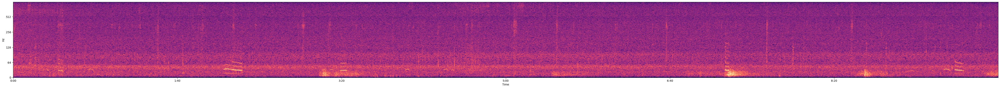
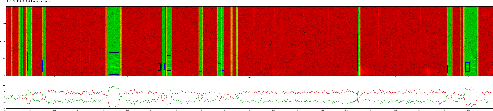
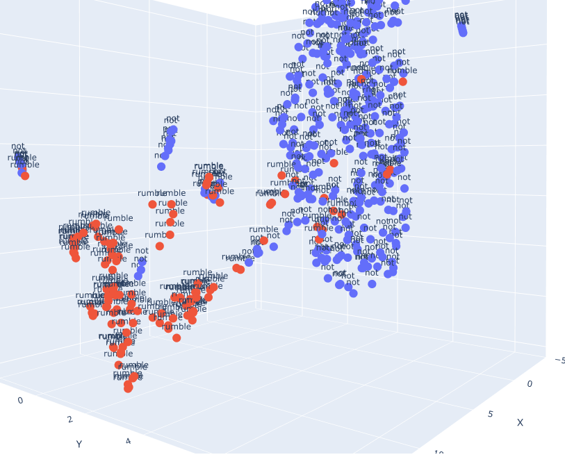
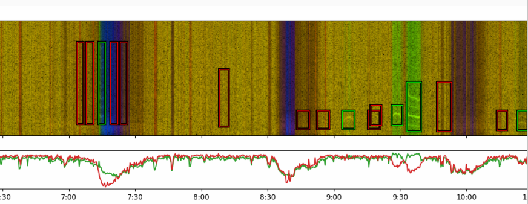
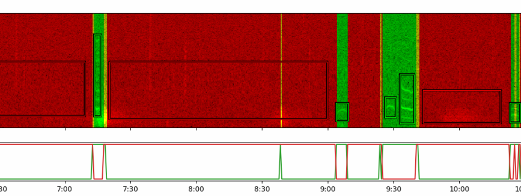
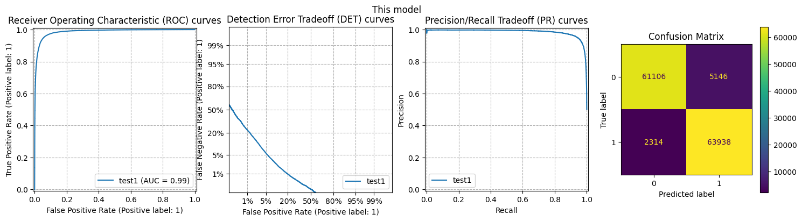
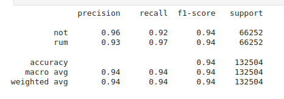

# Elephant Rumble Inference (using AVES/HuBERT based transformer models)


* An AVES/HuBERT transformer based Elephant Rumble Detector for the [FruitPunch AI "AI For Forest Elephants"](https://app.fruitpunch.ai/challenge/ai-for-forest-elephants-2) project. 

* When trained and tested on the dataset [The Cornell Lab's Elephant Listening Project](https://www.elephantlisteningproject.org/) provided FruiltPunch, it scores well.
  *  f1-scores, precision, recall, and accuracy all in the high 90%s (details below).


From Central African soundscapes like this ...



... this model isolates the elephant-related sounds like this ...



... by efficiently classifying each fraction of a second of 24-hour audio files as "elephant" or "not elephant", and generating a structured ["Raven Selection File"](https://store.birds.cornell.edu/collections/raven-sound-software) for the elephant-related time-intervals.

Challenging because:

* Such forests have complex background sounds from a wide variety of animals.
* Forests muffle sounds, and Elephants far away from the recording devices may have sounds barely above noise levels.
* High quality off-the-shelf audio classifiers tend to do best on human voices, birds, or man-made devices.

## Usage

```
pip install git+https://github.com/ramayer/elephant-rumble-inference@v0.3.0
```

```
elephant-rumble-inference \
    --save-raven \
    --visualizations-per-audio-file=10 \
    ./data/Rumble/Test/*/*.wav
```

Example [Google Colab inference notebook here](https://colab.research.google.com/gist/ramayer/efdeb0f90184115aba756b023beedc5f/elephant_inference_test.ipynb).  The [Training Notebook that generated the higest scoring model so far can be seen here](https://github.com/ramayer/elephant-rumble-inference/blob/main/notebooks/training_notebook.ipynb).


More detailed usage examples below.

## Detailed Design

### Based on [“AVES: Animal Vocalization Encoder based on Self-Supervision”](https://arxiv.org/abs/2210.14493)

* https://arxiv.org/abs/2210.14493
* AVES, in turn, is based on [HuBERT](https://arxiv.org/abs/2106.07447), a self-supervised transformer architecture for modeling raw waveforms (not spectrograms), originally for human speech.
* AVES-bio was pre-trained on a wide-range of unlabeled biological sounds; and performs well when fine tuned for specific animals (cows, crows, bats, whales, mosquitos, fruit-bats, …), when compared against spectrogram-based models like resnets.

Unlike most other approaches in this challenge, this model directly analyzes the audio waveforms, without every generating spectrogram images or using any image-classification or object-detection models.


### Challenge - Identifying which clusters are elephants.

Because AVES an unsupervised model, trained
on unannotated audio inputs, it needs to
either be fine-tuned or augmented with 
additional classifiers trained to recognize 
animals of interest.

* AVES is great at creating clusters of similar biological sounds
* But doesn’t know which clusters go with which animals.
* Visualizing AVES embeddings shows this is a promising approach.

The image below shows a [UMAP](https://pair-code.github.io/understanding-umap/) visualization of AVES embeddings of our data:

* Red = elephants in our labeled data.
* Blue = non-elephant sound clips from the same .wav files.



Observe that there are multiple distinct clusters.   Listening to the sounds associated with each cluster suggests:

* The multiple distinct red clusters seem to represent different kinds of sounds Elephants can make, ranging from [trumpeting](https://www.ncbi.nlm.nih.gov/pmc/articles/PMC8610244/) and [squeeking](https://bmcbiol.biomedcentral.com/articles/10.1186/s12915-021-01026-z). Often, it seems, a rumble creschendos into roaring or trumpeting.  ["the fundamental frequency within a single elephant call may vary over 4 octaves, starting with a Rumble at 27 Hz and grading into a Roar at 470 Hz! "](https://www.elephantvoices.org/elephant-communication/acoustic-communication.html#:~:text=By%20contrast%2C%20the%20fundamental%20frequency,well%20as%20extremely%20powerful%20sounds.)
* Different small blue clusters represent different animals in the background sounds.  Monkeys, Buffalo, Birds and Insects are all present in the trainind data.
* The large blue cluster is non-specific background noise and other non-biological sound that AVES-bio was trained to be largely indifferent to; including wind, rain, thunder, etc. 
* The path connecting the main elephant-rumble-cluster with the blue background noise cluster seems to represent fainter-and-fainter 

While it's likely a simpler [Support Vector Machine](https://x.com/karpathy/status/1647025230546886658?lang=en) should have been able to separate those clusters; all my attempts failed, perhaps because elephant trumpeting is more like other animals than it is to elephant rumbles, and I'd need a [kernel trick](https://en.wikipedia.org/wiki/Kernel_method#Mathematics:_the_kernel_trick) to make a SVM put the large variety of elephant sounds into a single class.   Instead I gave up on that approach and added a simple two-fully-connected-layer model that performed well when given an appropriate mix of positive and negative training data.







### Challenges.
* Challenge 1 - AVES didn’t have our frequencies or timescales in mind:
  * AVES seems easily distracted by high pitched animals in the background noise.
HuBERT - designed to recognize syllables in speech - generates feature vectors at a 20ms timescale - which would be expensive on our 24-hour-long clips.

* Solution 1 - resample and pitch-shift through re-tagging.
Re-sample and re-tag our audio to pretend 1kHz is 16kHz
    *  (thx for this technique, Arnoud)
  * By a happy coincidence this helps with both problems.
  * Pitch-shifts up the audio up by 4 octaves
Shifts a 20 - 200 Hz elephant rumble to 320-3200Hz 
And pushes a 2kHz bird to 32kHz where it’s largely ignored by the model.
  * Turns a ½ second elephant-rumble-syllable to 31ms (~ HuBERT’s timescale)
  * Reduces compute by a factor of 16.

And as a side-effect, it shifts elephant speech into human hearing ranges, and they sound awesome!!!

## Metrics

The version of the model being tested here was
* Trained on every single labeled rumble from FruitPunch.AI's     
`01. Data/cornell_data/Rumble/Training`    
and an equal duration of unlabeled segments from the same audio files assumed to be non-elephant-related.
* Tested entirely against every labeled rumble from     
 `01. Data/cornell_data/Rumble/Testing`
and an equal duration uf unabled sounds from the same files.

Unfortunately these datasets are not publically but you might reach out to [The Elephant Listening Project](https://www.elephantlisteningproject.org/) and/or [FruitPunch.ai](https://fruitpunch.ai). 

In both cases:

* the things being classified are 1/3-of-a-second slices of the audio.
* every single 1/3-of-a-second that was labeled in the Raven files was considered a "positive".
* about the same many 1/3s of a second from the files were used as "negative" labels.  Those were picked to be near in time to the "positive" samples to try to capture similar background noise (buffalos, airplanes, bugs).







Many of the wrong guesses seem to be related to:

* Differences in opinions of where a rumble starts or ends.   
If the Raven File thinks a rumble starts ends 2/3 of a second sooner than this classifier, that difference in overlap counts as a false negative and a false positive.
* Some unusual background noises that I didn't yet add to the manual "negative" classes.  If it's "animal-like", AVES may consider it "more elephant-like than not" unless I provide the companion model appropriate negative training samples.

Could I set up some time to have someone code-review my code?
I'm hoping I'm doing this evaluation fairly.   The notebook with the entire training run that produced this particular model can be found here:
https://github.com/ramayer/elephant-rumble-inference/blob/main/notebooks/training_notebook.ipynb (edited) 


## Performance Notes

This really wants a GPU.   

* It processes 24 hours of audio in 22 seconds on a 2060 GPU
* It processes 24 hours of audio in 28 minutes on a CPU

so about a 70x speedup on a GPU.

This has not been tested on a GPU with less than 6GB of RAM.


## Windows instructions

* I was only able to make this work using conda
* conda install ffmpeg (seems torchaudio StreamReaders use ffmpeg)?

## MacOS Instructions. 

As per: https://pytorch.org/audio/stable/installation.html "TorchAudio official binary distributions are compatible with FFmpeg version 6, 5 and 4. (>=4.4, <7)." -- so it specifically needs an older version of ffmpeg.

I needed to `brew install ffmpeg@6` for it to run properly

## Detailed usage instructions

### for inference

* TODO - add this.

### for training

* TODO - add this.

# Future work

   * Despite performing well on the audio recorders in both this project's test and train datasets, the version of the model pretrained performs poorly in environments with different background noises like [these South African elephant recordings](https://www.youtube.com/watch?v=3yldufeCt-I).    It regains its performance by re-training with negative "not an elephant" exampes of background noise from these other regions.   Training a version with more diverse not-elephant sounds would produce a more robust version.
